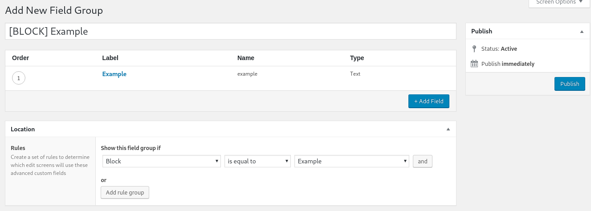

# k1sul1/wordpress-theme-base

My idea of the perfect starting point for WordPress themes. Modern tooling in the frontend and utilities to keep you from repeating yourself.

I've shipped dozens of custom made WordPress sites and made a few of these starting points. None of them have been perfect, but this one works pretty damn well for me.

See also: [k1sul1/docker-wordpress-spa-template](https://github.com/k1sul1/docker-wordpress-cra-spa-template) for a local / production Docker environment with Let's Encrypt. It's built for single page applications but can be dumbed down by removing irrelevant services and configuration pieces.

WIP, some of the old source still exists, but tooling has been upgraded and everything should be functional.

## Features

Hopefully just enough for you to build the next best WordPress site, without getting in your way.

### The real deal
- Custom Gutenberg block support
 - With a few generic blocks
- Multilinguality support
  - including, but not limited to: ACF options pages & theme strings
- Automagical asset manifests, ensures that visitors always see the latest assets
- Reusable & combinable data-driven templates
- Theme image optimization (Imagemin)
- Sourcemaps to help you locate troublemakers in CSS & JS
- Integrates with [k1 kit](https://github.com/k1sul1/k1kit)

### Nice to haves
- Hot module reloading (HMR) for CSS & _compatible_ JS
- OOTB React support
- CSS preprocessor support
  - I prefer Stylus, if you want to use SCSS, that's easy. Install `node-sass` & `sass-loader`, replace `stylus-loader` with `scss-loader` and `.styl` with `.scss` in webpack config. Porting the styles shouldn't be too cumbersome.
- PostCSS
  - Autoprefixer
  - Flexbugs fixer
- `<title>` is prefixed with the current environment to avoid confusion when working with multiple instances
- Namespaces

## Requirements

- PHP 7, I run 7.3 at the time of writing
- Node 10 on the host machine
- ACF PRO 5.8
  - If you don't want to create custom blocks, free version should work as well

## Recommendations
- Polylang
  - If your site has only one language, don't install Polylang, and just change `languageSlugs` option in `functions.php` to match your language.
- [k1 kit](https://github.com/k1sul1/k1kit)
  - Makes the theme faster by utilizing transients. If you don't need transients, you don't need this either.
  - Transients created by the plugin are somewhat manageable, but the plugin is still in early development. I use it in production in some sites, you do you.
- The SEO Framework
  - Unlike Yoast, has no bloat, and has all the necessary features
  - Ensures that a `<title>` element always exists; WP frontpages often lack them.


## Install

```
composer require k1sul1/wordpress-theme-base
```

You might have to add dev-master as version until I create a release.

## Setup
Edit `config.json` to match your WordPress setup. Arguably not very hard. Run `npm install`.

To run webpack-dev-server (WDS), run `npm run dev`.
To create a production build, run `npm run build`.

In webpack-dev-server, CSS should update automatically without reloading, as should any module.hot compatible code. React should work out of the box. Due to recent ~~technological advancements~~ configuration changes,
it's now possible to run WDS "in the background". Previously you've had to open `http://yoursite.local:8080` and develop in that, but that shouldn't be necessary any more. If it doesn't work, try :8080 and submit an issue.

## Help
### I don't want to use React
That's ok. Removing React from the bundles is easy with minor configuration modifications.

In `.babelrc.js`, comment out the following
- @babel/plugin-transform-react-jsx
- react-hot-loader/babel
- @babel/preset-react

In addition to that, you have to edit `config/webpack.client.js`, and change `client` in `entries`. Comment or remove react-hot-loader:
`client: [/* 'react-hot-loader/patch', */path.join(source, 'js', 'client')]`

Now React won't be present.

### webpack-dev-server
WDS makes your life a lot easier, especially now that it can run in the background.

Previously, it had a few drawbacks / limitations / annoyances. Because it's a proxy server, it runs in a different origin, and that might cause CORS problems. These problems could be dealt with programmatically, but it was not unusual to see form submissions failing, etc.

It's perfectly fine to use this theme without using WDS, simply run `npm run dev:noproxy` instead of `npm run dev`.

Please note that overcoming the limitations requires opening gaping security holes, and that is done only when `WP_ENV === 'development'`, so make sure to define it in your wp-config.php, if you don't have it already.

**DO NOT** set WP_ENV to `development` on a server accessible from the internet!


### I want to create Gutenberg blocks but I don't want to use ACF Blocks
Good luck. It's possible, but something that I'm not interested in supporting.

Create a new entry to `config/webpack.client.js` and start coding.

### Block creation

Create a file to blocks/. Name it whatever you want, just capitalize the first letter.

```php
<?php
// blocks/Example.php
namespace k1\Blocks;

class Example extends \k1\Block {
  public function render($data = []) { ?>
    <div class="example-block">
      <?=get_field('example')?>
    </div>
  <?php
  }

  /*
   * If you need to change the settings, that's easy.
   * If you don't, don't define this function.
   */
  public function getSettings() {
    $data = parent::getSettings();
    $data['mode'] = 'preview';

    return $data;
  }
}
```

Then just add a new field group, like you normally would. Just select your block as the location.



### How does HMR work?
With black magic. Once you understand that, it's pretty simple. CSS is stateless and easy to replace, but JavaScript is trickier. You explicitly have to declare something as hot reloadable, but this can be done with abstractions, such as react-hot-loader.

To add HMR support to your own JS is "easy", simply add
```
if (module.hot) {
  module.hot.accept('./path/to/file.js', (x) => {
    // do something
  })
}
```
to the relevant location.
